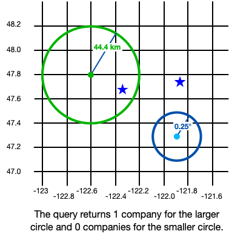

# CRUD - Read - Swift SDK
## Read from a Realm
A read from a realm generally consists of the following
steps:

- Get all objects of a certain type from the realm.
- Optionally, filter the results.
- Optionally, sort the results.
- Alternately, get all objects of a certain type, divided into
sections. As with regular results, you can
filter and sort sectioned results.

Query, filter, and sort operations return either a results or
SectionedResults collection. These
collections are live, meaning they always contain the latest
results of the associated query.

### Read Characteristics
When you design your app's data access patterns around the
following three key characteristics of reads in Realm,
you can be confident you are reading data as
efficiently as possible.

#### Results Are Not Copies
Results to a query are not copies of your data: modifying
the results of a query will modify the data on disk
directly. This memory mapping also means that results are
**live**: that is, they always reflect the current state on
disk.

See also: Collections are Live.

#### Results Are Lazy
Realm only runs a query when you actually request the
results of that query. This lazy evaluation enables you to write
elegant, highly performant code for handling large data sets and complex
queries. You can chain several filter and sort operations without requiring extra work to process the
intermediate state.

#### References Are Retained
One benefit of Realm's object model is that
Realm automatically retains all of an object's
relationships as direct
references, so you can traverse your graph of relationships
directly through the results of a query.

A **direct reference**, or pointer, allows you to access a
related object's properties directly through the reference.

Other databases typically copy objects from database storage
into application memory when you need to work with them
directly. Because application objects contain direct
references, you are left with a choice: copy the object
referred to by each direct reference out of the database in
case it's needed, or just copy the foreign key for each
object and query for the object with that key if it's
accessed. If you choose to copy referenced objects into
application memory, you can use up a lot of resources for
objects that are never accessed, but if you choose to only
copy the foreign key, referenced object lookups can cause
your application to slow down.

Realm bypasses all of this using zero-copy
live objects. Realm object accessors point
directly into database storage using memory mapping, so there is no
distinction between the objects in Realm and the results
of your query in application memory. Because of this, you can traverse
direct references across an entire realm from any query result.

### Limiting Query Results
As a result of lazy evaluation, you do not need any special mechanism to
limit query results with Realm. For example, if your query
matches thousands of objects, but you only want to load the first ten,
simply access only the first ten elements of the results collection.

### Pagination
Thanks to lazy evaluation, the common task of pagination becomes quite
simple. For example, suppose you have a results collection associated
with a query that matches thousands of objects in your realm. You
display one hundred objects per page. To advance to any page, simply
access the elements of the results collection starting at the index that
corresponds to the target page.

## Read Realm Objects
### About The Examples On This Page
The examples on this page use the following models:

#### Objective-C

```objectivec
// DogToy.h
@interface DogToy : RLMObject
@property NSString *name;
@end

// Dog.h
@interface Dog : RLMObject
@property NSString *name;
@property int age;
@property NSString *color;

// To-one relationship
@property DogToy *favoriteToy;

@end

// Enable Dog for use in RLMArray
RLM_COLLECTION_TYPE(Dog)

// Person.h
// A person has a primary key ID, a collection of dogs, and can be a member of multiple clubs.
@interface Person : RLMObject
@property int _id;
@property NSString *name;

// To-many relationship - a person can have many dogs
@property RLMArray<Dog *><Dog> *dogs;

// Inverse relationship - a person can be a member of many clubs
@property (readonly) RLMLinkingObjects *clubs;
@end

RLM_COLLECTION_TYPE(Person)

// DogClub.h
@interface DogClub : RLMObject
@property NSString *name;
@property RLMArray<Person *><Person> *members;
@end

// Dog.m
@implementation Dog
@end

// DogToy.m
@implementation DogToy
@end

// Person.m
@implementation Person
// Define the primary key for the class
+ (NSString *)primaryKey {
    return @"_id";
}

// Define the inverse relationship to dog clubs
+ (NSDictionary *)linkingObjectsProperties {
    return @{
        @"clubs": [RLMPropertyDescriptor descriptorWithClass:DogClub.class propertyName:@"members"],
    };
}
@end

// DogClub.m
@implementation DogClub
@end

```

#### Swift

```swift
class DogToy: Object {
    @Persisted var id: ObjectId
    @Persisted var name = ""
}

class Dog: Object {
    @Persisted var name = ""
    @Persisted var age = 0
    @Persisted var color = ""
    @Persisted var currentCity = ""
    @Persisted var citiesVisited: MutableSet<String>
    @Persisted var companion: AnyRealmValue

    // To-one relationship
    @Persisted var favoriteToy: DogToy?

    // Map of city name -> favorite park in that city
    @Persisted var favoriteParksByCity: Map<String, String>
    
    // Computed variable that is not persisted, but only
    // used to section query results.
    var firstLetter: String {
        return name.first.map(String.init(_:)) ?? ""
    }
}
class Person: Object {
    @Persisted(primaryKey: true) var id = 0
    @Persisted var name = ""

    // To-many relationship - a person can have many dogs
    @Persisted var dogs: List<Dog>

    // Inverse relationship - a person can be a member of many clubs
    @Persisted(originProperty: "members") var clubs: LinkingObjects<DogClub>

    // Embed a single object.
    // Embedded object properties must be marked optional.
    @Persisted var address: Address?

    convenience init(name: String, address: Address) {
        self.init()
        self.name = name
        self.address = address
    }
}

class DogClub: Object {
    @Persisted var name = ""
    @Persisted var members: List<Person>

    // DogClub has an array of regional office addresses.
    // These are embedded objects.
    @Persisted var regionalOfficeAddresses: List<Address>

    convenience init(name: String, addresses: [Address]) {
        self.init()
        self.name = name
        self.regionalOfficeAddresses.append(objectsIn: addresses)
    }
}

class Address: EmbeddedObject {
    @Persisted var street: String?
    @Persisted var city: String?
    @Persisted var country: String?
    @Persisted var postalCode: String?
}

```

### Find a Specific Object by Primary Key
#### Objective-C

If you know the primary key for
a given object, you can look it up directly with
`+[RLMObject objectForPrimaryKey:]`.

```objectivec
// Get a specific person from the default realm
Person *specificPerson = [Person objectForPrimaryKey:@12345];

```

#### Swift

If you know the primary key for a given
object, you can look it up directly with
`Realm.object(ofType:forPrimaryKey:)`.

```swift
let realm = try! Realm()

let specificPerson = realm.object(ofType: Person.self, forPrimaryKey: 12345)

```

### Query All Objects of a Given Type
#### Objective-C

To query for objects of a given type in a realm, pass the realm
instance to `+[YourRealmObjectClass allObjectsInRealm:]`.
Replace `YourRealmObjectClass` with your Realm object class
name. This returns an `RLMResults` object representing all objects of the
given type in the realm.

```objectivec
RLMRealm *realm = [RLMRealm defaultRealm];

RLMResults *dogs = [Dog allObjectsInRealm:realm];
RLMResults *people = [Person allObjectsInRealm:realm];

```

#### Swift

To query for objects of a given type in a realm, pass the metatype
instance `YourClassName.self` to `Realm.objects(_)`.
This returns a `Results` object
representing all objects of the given type in the realm.

```swift
let realm = try! Realm()
// Access all dogs in the realm
let dogs = realm.objects(Dog.self)

```

### Filter Queries Based on Object Properties
A filter selects a subset of results based on the value(s) of one or
more object properties. Realm provides a full-featured
query engine that you can use to define filters.

#### Swift

> Version added: 10.19.0

To use the Realm Swift Query API,
call `.where` with a closure that
contains a query expression as an argument.

```swift
let realm = try! Realm()
// Access all dogs in the realm
let dogs = realm.objects(Dog.self)

// Query by age
let puppies = dogs.where {
    $0.age < 2
}

// Query by person
let dogsWithoutFavoriteToy = dogs.where {
    $0.favoriteToy == nil
}

// Query by person's name
let dogsWhoLikeTennisBalls = dogs.where {
    $0.favoriteToy.name == "Tennis ball"
}

```

#### Swift Nspredicate

To filter, call `Results.filter(_:)`
with a query predicate.

```swift
let realm = try! Realm()
// Access all dogs in the realm
let dogs = realm.objects(Dog.self)

// Filter by age
let puppies = dogs.filter("age < 2")

// Filter by person
let dogsWithoutFavoriteToy = dogs.filter("favoriteToy == nil")

// Filter by person's name
let dogsWhoLikeTennisBalls = dogs.filter("favoriteToy.name == 'Tennis ball'")

```

#### Objective-C

To filter, call `-[RLMResults objectsWhere:]`
with a query predicate.

```objectivec
RLMRealm *realm = [RLMRealm defaultRealm];

// Access all dogs in the realm
RLMResults *dogs = [Dog allObjectsInRealm:realm];

// Filter by age
RLMResults *puppies = [dogs objectsWhere:@"age < 2"];

// Filter by favorite toy
RLMResults *dogsWithoutFavoriteToy = [dogs objectsWhere:@"favoriteToy == nil"];

// Filter by favorite toy's name
RLMResults *dogsWhoLikeTennisBalls = [dogs objectsWhere:@"favoriteToy.name == %@", @"Tennis ball"];

```

> Tip:
> To filter a query based on a property of an embedded object or a related object, use dot-notation as if it were
in a regular, nested object.
>

### Filter on Object ID Properties
The types in your predicate must match the types of the
properties. Avoid comparing
`ObjectId` properties to strings, as
Realm does not automatically convert strings to ObjectIds.

#### Swift

> Version added: 10.19.0

The Realm Swift Query API's built-in type safety simplifies writing a
query with an ObjectId:

```swift
let realm = try! Realm()

let dogToys = realm.objects(DogToy.self)

// Get specific user by ObjectId id
let specificToy = dogToys.where {
    $0.id == ObjectId("11223344556677889900aabb")
}

```

#### Swift Nspredicate

The following example shows the correct and incorrect way to write a
query with an ObjectId given the following Realm object:

```swift
let realm = try! Realm()

let dogToys = realm.objects(DogToy.self)

// Get specific toy by ObjectId id
let specificToy = dogToys.filter("id = %@", ObjectId("11223344556677889900aabb")).first

// WRONG: Realm will not convert the string to an object id
// users.filter("id = '11223344556677889900aabb'") // not ok
// users.filter("id = %@", "11223344556677889900aabb") // not ok

```

### Query a Relationship
You can query through a relationship the same way you would access a
member of a regular Swift or Objective-C object.

#### Objective-C

```objectivec
RLMRealm *realm = [RLMRealm defaultRealm];

// Establish a relationship
Dog *dog = [[Dog alloc] init];
dog.name = @"Rex";
dog.age = 10;

Person *person = [[Person alloc] init];
person._id = 12345;
[person.dogs addObject:dog];

[realm transactionWithBlock:^() {
    [realm addObject:person];
}];

// Later, query the specific person
Person *specificPerson = [Person objectForPrimaryKey:@12345];

// Access directly through a relationship
NSLog(@"# dogs: %lu", [specificPerson.dogs count]);
NSLog(@"First dog's name: %@", specificPerson.dogs[0].name);

```

#### Swift

```swift
let realm = try! Realm()

// Establish a relationship
let dog = Dog()
dog.name = "Rex"
dog.age = 10

let person = Person()
person.id = 12345
person.dogs.append(dog)

try! realm.write {
    realm.add(person)
}

// Later, query the specific person
let specificPerson = realm.object(ofType: Person.self, forPrimaryKey: 12345)

// Access directly through a relationship
let specificPersonDogs = specificPerson!.dogs
let firstDog = specificPersonDogs[0]
print("# dogs: \(specificPersonDogs.count)")
print("First dog's name: \(firstDog.name)")

```

### Query an Inverse Relationship
You can query through an inverse relationship the same way you would
access a member of a regular Swift or Objective-C object.

#### Objective-C

```objectivec
RLMRealm *realm = [RLMRealm defaultRealm];

// Establish a relationship
Person *person = [[Person alloc] init];
person._id = 12345;

DogClub *club = [[DogClub alloc] init];
club.name = @"Pooch Pals";
[club.members addObject:person];

[realm transactionWithBlock:^() {
    [realm addObject:club];
}];

// Later, query the specific person
Person *specificPerson = [Person objectForPrimaryKey:@12345];
    
// Access directly through an inverse relationship
NSLog(@"# memberships: %lu", [specificPerson.clubs count]);
NSLog(@"First club's name: %@", [specificPerson.clubs[0] name]);

```

#### Swift

```swift
let realm = try! Realm()

// Establish an inverse relationship
let person = Person()
person.id = 12345

let club = DogClub()
club.name = "Pooch Pals"
club.members.append(person)

try! realm.write {
    realm.add(club)
}

// Later, query the specific person
let specificPerson = realm.object(ofType: Person.self, forPrimaryKey: 12345)

// Access directly through an inverse relationship
let clubs = specificPerson!.clubs
let firstClub = clubs[0]
print("# memberships: \(clubs.count)")
print("First club's name: \(firstClub.name)")

```

### Query a Collection on Embedded Object Properties
Use dot notation to filter or sort a collection of objects based on an embedded object
property value:

> Note:
> It is not possible to query embedded objects directly. Instead,
access embedded objects through a query for the parent object type.
>

#### Swift

> Version added: 10.19.0

```swift
// Open the default realm
let realm = try! Realm()

// Get all contacts in Los Angeles, sorted by street address
let losAngelesPeople = realm.objects(Person.self)
    .where {
        $0.address.city == "Los Angeles"
    }
    .sorted(byKeyPath: "address.street")
print("Los Angeles Person: \(losAngelesPeople)")

```

#### Swift Nspredicate

```swift
// Open the default realm
let realm = try! Realm()

// Get all people in Los Angeles, sorted by street address
let losAngelesPeople = realm.objects(Person.self)
    .filter("address.city = %@", "Los Angeles")
    .sorted(byKeyPath: "address.street")
print("Los Angeles Person: \(losAngelesPeople)")

```

#### Objective-C

```objectivec
RLMRealm *realm = [RLMRealm defaultRealm];
RLMResults<Contact *> *losAngelesContacts = [Contact objectsInRealm:realm where:@"address.city = %@", @"Los Angeles"];

losAngelesContacts = [losAngelesContacts sortedResultsUsingKeyPath:@"address.street" ascending:YES]; 
NSLog(@"Los Angeles Contacts: %@", losAngelesContacts);

```

### Query a Map Property
You can iterate and check the values of a realm `map`
as you would a standard [Dictionary](https://developer.apple.com/documentation/swift/dictionary):

```swift
let realm = try! Realm()

let dogs = realm.objects(Dog.self)

// Find dogs who have favorite parks
let dogsWithFavoriteParks = dogs.where {
    $0.favoriteParksByCity.count >= 1
}

for dog in dogsWithFavoriteParks {
    // Check if an entry exists
    if dog.favoriteParksByCity.keys.contains("Chicago") {
        print("\(dog.name) has a favorite park in Chicago")
    }

    // Iterate over entries
    for element in dog.favoriteParksByCity {
        print("\(dog.name)'s favorite park in \(element.key) is \(element.value)")
    }
}

```

### Query a MutableSet Property
You can query a `MutableSet` to check if
it contains an element. If you are working with multiple sets, you can
check for the intersection of two sets, or check whether one set is a subset
of the other set.

```swift
let realm = try! Realm()

// Find dogs who have visited New York
let newYorkDogs = realm.objects(Dog.self).where {
    $0.citiesVisited.contains("New York")
}

// Get some information about the cities they have visited
for dog in newYorkDogs {
    print("Cities \(dog.name) has visited: \(dog.citiesVisited)")
}

// Check whether two dogs have visited some of the same cities.
// Use "intersects" to find out whether the values of the two sets share common elements.
let isInBothCitiesVisited = (dog.citiesVisited.intersects(dog2.citiesVisited))
print("The two dogs have visited some of the same cities: \(isInBothCitiesVisited)")
// Prints "The two dogs have visited some of the same cities: true"

// Or you can check whether a set is a subset of another set. In this example,
// the first dog has visited "New York" and "Toronto", while dog2 has visited both of
// those but also "Toronto" and "Boston".
let isSubset = (dog.citiesVisited.isSubset(of: dog2.citiesVisited))
print("\(dog.name)'s set of cities visited is a subset of \(dog2.name)'s: \(isSubset)")
// Prints "Maui's set of cities visited is a subset of Lita's: true"

```

### Read and Query AnyRealmValue Property
When you read an AnyRealmValue property, check the value's type before doing
anything with it. The Realm Swift SDK provides an `AnyRealmValue enum` that iterates through all of the types the
AnyRealmValue can store.

```swift
let realm = try! Realm()

let dogs = realm.objects(Dog.self)

for dog in dogs {
    // Verify the type of the ``AnyRealmProperty`` when attempting to get it. This
    // returns an object whose property contains the matched type.

    // If you only care about one type, check for that type.
    if case let .string(companion) = dog.companion {
        print("\(dog.name)'s companion is: \(companion)")
        // Prints "Wolfie's companion is: Fluffy the Cat"
    }

    // Or if you want to do something with multiple types of data
    // that could be in the value, switch on the type.
    switch dog.companion {
    case .string:
        print("\(dog.name)'s companion is: \(dog.companion)")
        // Prints "Wolfie's companion is: string("Fluffy the Cat")
    case .object:
        print("\(dog.name)'s companion is: \(dog.companion)")
        // Prints "Fido's companion is: object(Dog { name = Spot })"
    case .none:
        print("\(dog.name) has no companion")
        // Prints "Rex has no companion" and "Spot has no companion"
    default:
        print("\(dog.name)'s companion is another type.")
    }
}

```

You can compare these mixed value types:

- Numeric: int, bool, float, double, decimal
- Byte-based: string, binary
- Time-based: timestamp, objectId

When using the `AnyRealmValue` mixed data type, keep these things in mind:

- `equals` queries match on value and type
- `not equals` queries match objects with either different values or
different types
- realm converts comparable numeric properties where possible. For example,
in a mixed type field, 1 matches all of 1.0, 1, and true.
- String properties do not match numeric queries. For example, in a mixed
type field, 1 does not match "1". "1" does not match 1, 1.0, or true.

### Query Geospatial Data
> Version added: 10.47.0

The Swift SDK provides several shapes to simplify querying
geospatial data. You can use the
`GeoCircle`, `GeoBox`, and `GeoPolygon` shapes to set the boundaries for
your geospatial data queries.

The SDK provides two specialized non-persistable data types to define shapes:

- `GeoPoint`: A struct that represents the coordinates of a point formed by
a pair of doubles consisting of these values: Latitude: ranges between -90 and 90 degrees, inclusive.Longitude: ranges between -180 and 180 degrees, inclusive.
- `RLMDistance`: A helper struct to represent and convert a distance.

#### Define Geospatial Shapes
#### Geocircle

A `GeoCircle` is a circular shape whose bounds originate from a central
`GeoPoint`, and has a size corresponding to a radius measured in
radians. You can use the SDK's convenience `RLMDistance` data type to
easily work with radii in different units.

`RLMDistance` enables you to specify the radius distance for your geo shapes
in one of four units:

- `.degrees`
- `.kilometers`
- `.miles`
- `.radians`

You can optionally use the supplied convenience methods to convert a
measurement to a different distance units.

```swift
// You can create a GeoCircle radius measured in radians.
// This radian distance corresponds with 0.25 degrees.
let smallCircle = GeoCircle(center: (47.3, -121.9), radiusInRadians: 0.004363323)

// You can also create a GeoCircle radius measured with a Distance.
// You can specify a Distance in .degrees, .kilometers, .miles, or .radians.
let largeCircle = GeoCircle(center: GeoPoint(latitude: 47.8, longitude: -122.6)!, radius: Distance.kilometers(44.4)!)

```


#### Geobox

A `GeoBox` is a rectangular shape whose bounds are determined by
coordinates for a bottom-left and a top-right corner.

```swift
let largeBox = GeoBox(bottomLeft: (47.3, -122.7), topRight: (48.1, -122.1))

let smallBoxBottomLeft = GeoPoint(latitude: 47.5, longitude: -122.4)!
let smallBoxTopRight = GeoPoint(latitude: 47.9, longitude: -121.8)
let smallBox = GeoBox(bottomLeft: smallBoxBottomLeft, topRight: smallBoxTopRight!)

```


#### Geopolygon

A `GeoPolygon` is a polygon shape whose bounds consist of an outer
ring, and 0 or more inner holes to exclude from the geospatial query.

A polygon's outer ring must contain at least three segments. The last
and the first `GeoPoint` must be the same, which indicates a closed
polygon. This means that it takes at least four `GeoPoint` values to
construct a polygon.

Inner holes in a `GeoPolygon` must be entirely contained within the
outer ring.

Holes have the following restrictions:

- Holes may not cross. The boundary of a hole may not intersect both the
interior and the exterior of any other hole.
- Holes may not share edges. If a hole contains an edge AB, then no other
hole may contain it.
- Holes may share vertices. However, no vertex may appear twice in a
single hole.
- No hole may be empty.
- Only one nesting is allowed.

```swift
// Create a basic polygon
let basicPolygon = GeoPolygon(outerRing: [
    (48.0, -122.8),
    (48.2, -121.8),
    (47.6, -121.6),
    (47.0, -122.0),
    (47.2, -122.6),
    (48.0, -122.8)
])

// Create a polygon with one hole
let outerRing: [GeoPoint] = [
    GeoPoint(latitude: 48.0, longitude: -122.8)!,
    GeoPoint(latitude: 48.2, longitude: -121.8)!,
    GeoPoint(latitude: 47.6, longitude: -121.6)!,
    GeoPoint(latitude: 47.0, longitude: -122.0)!,
    GeoPoint(latitude: 47.2, longitude: -122.6)!,
    GeoPoint(latitude: 48.0, longitude: -122.8)!
]

let hole: [GeoPoint] = [
    GeoPoint(latitude: 47.8, longitude: -122.6)!,
    GeoPoint(latitude: 47.7, longitude: -122.2)!,
    GeoPoint(latitude: 47.4, longitude: -122.6)!,
    GeoPoint(latitude: 47.6, longitude: -122.5)!,
    GeoPoint(latitude: 47.8, longitude: -122.6)!
]

let polygonWithOneHole = GeoPolygon(outerRing: outerRing, holes: [hole])

// Add a second hole to the polygon
let hole2: [GeoPoint] = [
    GeoPoint(latitude: 47.55, longitude: -122.05)!,
    GeoPoint(latitude: 47.55, longitude: -121.9)!,
    GeoPoint(latitude: 47.3, longitude: -122.1)!,
    GeoPoint(latitude: 47.55, longitude: -122.05)!
]

let polygonWithTwoHoles = GeoPolygon(outerRing: outerRing, holes: [hole, hole2])

```


#### Query with Geospatial Shapes
You can then use these shapes in a geospatial query. You can query geospatial
data in three ways:

- Using the `.geoWithin()` operator with the type-safe Realm Swift Query API
- Using a `.filter()` with RQL
- Using a `.filter()` with an NSPredicate query

The examples below show the results of queries using these two `Company`
objects:

```swift
let company1 = Geospatial_Company()
company1.location = CustomGeoPoint(47.68, -122.35)

let company2 = Geospatial_Company(CustomGeoPoint(47.9, -121.85))

```


#### Geocircle

```swift
let companiesInSmallCircle = realm.objects(Geospatial_Company.self).where {
    $0.location.geoWithin(smallCircle!)
}
print("Number of companies in small circle: \(companiesInSmallCircle.count)")

let companiesInLargeCircle = realm.objects(Geospatial_Company.self)
    .filter("location IN %@", largeCircle)
print("Number of companies in large circle: \(companiesInLargeCircle.count)")

```



#### Geobox

```swift
let companiesInSmallBox = realm.objects(Geospatial_Company.self).where {
    $0.location.geoWithin(smallBox)
}
print("Number of companies in small box: \(companiesInSmallBox.count)")

let filterArguments = NSMutableArray()
filterArguments.add(largeBox)
let companiesInLargeBox = realm.objects(Geospatial_Company.self)
    .filter(NSPredicate(format: "location IN %@", argumentArray: filterArguments as? [Any]))
print("Number of companies in large box: \(companiesInLargeBox.count)")

```


#### Geopolygon

```swift
let companiesInBasicPolygon = realm.objects(Geospatial_Company.self).where {
    $0.location.geoWithin(basicPolygon!)
}
print("Number of companies in basic polygon: \(companiesInBasicPolygon.count)")

let companiesInPolygonWithTwoHoles = realm.objects(Geospatial_Company.self).where {
    $0.location.geoWithin(polygonWithTwoHoles!)
}
print("Number of companies in polygon with two holes: \(companiesInPolygonWithTwoHoles.count)")

```


### Query a Custom Persistable Property
When you use type projection to map unsupported
types to supported types, accessing those properties is often based on the
persisted type.

#### Queries on Realm Objects
When working with projected types, queries operate on the persisted type.
However, you can use the mapped types interchangeably with the persisted
types in arguments in most cases. The exception is queries on embedded
objects.

> Tip:
> Projected types support sorting and aggregates where
the persisted type supports them.
>

```swift
let akcClub = realm.objects(Club.self).where {
    $0.name == "American Kennel Club"
}.first!
// You can use type-safe expressions to check for equality
XCTAssert(akcClub.url == URL(string: "https://akc.org")!)

let clubs = realm.objects(Club.self)
// You can use the persisted property type in NSPredicate query expressions
let akcByUrl = clubs.filter("url == 'https://akc.org'").first!
XCTAssert(akcByUrl.name == "American Kennel Club")

```

#### Queries on Embedded Objects
You can query embedded types on the supported property types within the
object using memberwise equality.

Object link properties support equality comparisons, but do not support
memberwise comparisons. You can query embedded objects for memberwise
equality on all primitive types. You cannot perform memberwise comparison
on objects and collections.

#### Dynamic APIs
Because the schema has no concept of custom type mappings, reading data via
any of the dynamic APIs gives the underlying persisted type. Realm does
support writing mapped types via a dynamic API, and converts the projected
type to the persisted type.

The most common use of the dynamic APIs is migration. You can write projected
types during migration, and Realm converts the projected type to the persisted
type. However, reading data during a migration gives the underlying persisted
type.

## Read an Object Asynchronously
When you use an actor-isolated realm, you can use Swift concurrency features
to asynchronously query objects.

```swift
let actor = try await RealmActor()

// Read objects in functions isolated to the actor and pass primitive values to the caller
func getObjectId(in actor: isolated RealmActor, forTodoNamed name: String) async -> ObjectId {
    let todo = actor.realm.objects(Todo.self).where {
        $0.name == name
    }.first!
    return todo._id
}
let objectId = await getObjectId(in: actor, forTodoNamed: "Keep it safe")

```

If you need to manually advance the state of an observed realm on the main
thread or an actor-isolated realm, call `await realm.asyncRefresh()`.
This updates the realm and outstanding objects managed by the Realm to point to
the most recent data and deliver any applicable notifications.

For more information about working with realm using Swift concurrency features,
refer to Use Realm with Actors - Swift SDK.

## Sort Query Results
A sort operation allows you to configure the order in which Realm
Database returns queried objects. You can sort based on one or more
properties of the objects in the results collection. Realm only
guarantees a consistent order of results if you explicitly sort them.

#### Objective-C

To sort, call [-[RLMResults
sortedResultsUsingKeyPath:ascending:]](https://www.mongodb.com/docs/realm-sdks/objc/latest/Classes/RLMResults.html#/c:objc(cs)RLMResults(im)sortedResultsUsingKeyPath:ascending:)
with the desired key path to sort by.

```objectivec
RLMRealm *realm = [RLMRealm defaultRealm];

RLMResults *dogs = [Dog allObjectsInRealm:realm];

// Sort dogs by name
RLMResults *dogsSorted = [dogs sortedResultsUsingKeyPath:@"name" ascending:NO];

// You can also sort on the members of linked objects. In this example,
// we sort the dogs by their favorite toys' names.
RLMResults *dogsSortedByFavoriteToyName = [dogs sortedResultsUsingKeyPath:@"favoriteToy.name" ascending:YES];

```

#### Swift

> Version added: 10.11.0

You can sort using the type-safe keyPath by calling
`Results.sorted(by: )` with the
keyPath name and optional sort order:

```swift
let realm = try! Realm()
// Access all dogs in the realm
let dogs = realm.objects(Dog.self)

// Sort by type-safe keyPath
let dogsSorted = dogs.sorted(by: \.name)

```

To sort using the older API, call `Results.sorted(byKeyPath:ascending:)`
with the desired key path to sort by.

```swift
let realm = try! Realm()
// Access all dogs in the realm
let dogs = realm.objects(Dog.self)

let dogsSorted = dogs.sorted(byKeyPath: "name", ascending: false)

// You can also sort on the members of linked objects. In this example,
// we sort the dogs by their favorite toys' names.
let dogsSortedByFavoriteToyName = dogs.sorted(byKeyPath: "favoriteToy.name")

```

> Tip:
> To sort a query based on a property of an embedded object or a related object, use dot-notation as if it
were in a regular, nested object.
>

> Note:
> String sorting and case-insensitive queries are only supported for
character sets in 'Latin Basic', 'Latin Supplement', 'Latin Extended
A', and 'Latin Extended B' (UTF-8 range 0-591).
>

## Section Query Results
You can split results into individual sections. Each section corresponds
to a key generated from a property on the object it represents.

For example, you might add a computed variable to your object to get the
first letter of the `name` property:

```swift
// Computed variable that is not persisted, but only
// used to section query results.
var firstLetter: String {
    return name.first.map(String.init(_:)) ?? ""
}

```

Then, you can create a `SectionedResults`
type-safe collection for that object, and use it to retrieve objects sectioned
by that computed variable:

```swift
var dogsByFirstLetter: SectionedResults<String, Dog>

dogsByFirstLetter = realm.objects(Dog.self).sectioned(by: \.firstLetter, ascending: true)

```

You can get a count of the sections, get a list of keys, or access an individual
`ResultSection` by index:

```swift
let realm = try! Realm()

var dogsByFirstLetter: SectionedResults<String, Dog>

dogsByFirstLetter = realm.objects(Dog.self).sectioned(by: \.firstLetter, ascending: true)

// You can get a count of the sections in the SectionedResults
let sectionCount = dogsByFirstLetter.count

// Get an array containing all section keys for objects that match the query.
let sectionKeys = dogsByFirstLetter.allKeys
// This example realm contains 4 dogs, "Rex", "Wolfie", "Fido", "Spot".
// Prints ["F", "R", "S", "W"]
print(sectionKeys)

// Get a specific key by index position
let sectionKey = dogsByFirstLetter[0].key
// Prints "Key for index 0: F"
print("Key for index 0: \(sectionKey)")

// You can access Results Sections by the index of the key you want in SectionedResults.
// "F" is the key at index position 0. When we access this Results Section, we get dogs whose name begins with "F".
let dogsByF = dogsByFirstLetter[0]
// Prints "Fido"
print(dogsByF.first?.name)

```

You can also section using a callback. This enables you to section a
collection of primitives, or have more control over how the section key is
generated.

```swift
let realm = try! Realm()
let results = realm.objects(Dog.self)
let sectionedResults = results.sectioned(by: { String($0.name.first!) },
                                         sortDescriptors: [SortDescriptor.init(keyPath: "name", ascending: true)])
let sectionKeys = sectionedResults.allKeys

```

You can observe
`SectionedResults` and `ResultsSection` instances, and both conform to
`ThreadConfined`.

## Aggregate Data
You can use Realm's aggregation operators for sophisticated queries
against list properties.

#### Swift

> Version added: 10.19.0

```swift
let realm = try! Realm()

let people = realm.objects(Person.self)

// People whose dogs' average age is 5
people.where {
    $0.dogs.age.avg == 5
}

// People with older dogs
people.where {
    $0.dogs.age.min > 5
}

// People with younger dogs
people.where {
    $0.dogs.age.max < 2
}

// People with many dogs
people.where {
    $0.dogs.count > 2
}

// People whose dogs' ages combined > 10 years
people.where {
    $0.dogs.age.sum > 10
}

```

#### Swift Nspredicate

```swift
let realm = try! Realm()

let people = realm.objects(Person.self)

// People whose dogs' average age is 5
people.filter("dogs.@avg.age == 5")

// People with older dogs
people.filter("dogs.@min.age > 5")

// People with younger dogs
people.filter("dogs.@max.age < 2")

// People with many dogs
people.filter("dogs.@count > 2")

// People whose dogs' ages combined > 10 years
people.filter("dogs.@sum.age > 10")

```

#### Objective-C

```objectivec
RLMRealm *realm = [RLMRealm defaultRealm];

RLMResults *people = [Person allObjectsInRealm:realm];

// People whose dogs' average age is 5
[people objectsWhere:@"dogs.@avg.age == 5"];

// People with older dogs
[people objectsWhere:@"dogs.@min.age > 5"];

// People with younger dogs
[people objectsWhere:@"dogs.@max.age < 2"];

// People with many dogs
[people objectsWhere:@"dogs.@count > 2"];

// People whose dogs' ages combined > 10 years
[people objectsWhere:@"dogs.@sum.age > 10"];

```

## Chain Queries
Because results are lazily evaluated, you
can chain several queries together. Unlike traditional databases, this
does not require a separate trip to the database for each successive
query.

> Example:
> To get a result set for tan dogs, and tan dogs whose names start with
'B', chain two queries like this:
>
> #### Swift
>
> > Version added: 10.19.0
>
> ```swift
> let realm = try! Realm()
> let tanDogs = realm.objects(Dog.self).where {
>     $0.color == "tan"
> }
> let tanDogsWithBNames = tanDogs.where {
>     $0.name.starts(with: "B")
> }
>
> ```
>
>
> #### Swift Nspredicate
>
> ```swift
> let realm = try! Realm()
> let tanDogs = realm.objects(Dog.self).filter("color = 'tan'")
> let tanDogsWithBNames = tanDogs.filter("name BEGINSWITH 'B'")
>
> ```
>
>
> #### Objective-C
>
> ```objectivec
> RLMRealm *realm = [RLMRealm defaultRealm];
> RLMResults<Dog *> *tanDogs = [Dog objectsInRealm:realm where:@"color = 'tan'"];
> RLMResults<Dog *> *tanDogsWithBNames = [tanDogs objectsWhere:@"name BEGINSWITH 'B'"];
>
> ```
>
>

## Query Class Projections
To query for class projections in a
realm, pass the metatype instance `YourProjectionName.self` to
`Realm.objects(_)`.
This returns a `Results` object
representing all of the class projection objects in the realm.

```swift
// Retrieve all class projections of the given type `PersonProjection`
let people = realm.objects(PersonProjection.self)
// Use projection data in your view
print(people.first?.firstName)
print(people.first?.homeCity)
print(people.first?.firstFriendsName)

```

> Tip:
> Don't do derived queries on top of class projection results. Instead, run a
query against the Realm object directly and then project the result. If you
try to do a derived query on top of class projection results, querying a
field with the same name and type as the original object works, but querying
a field with a name or type that isn't in the original object fails.
>
