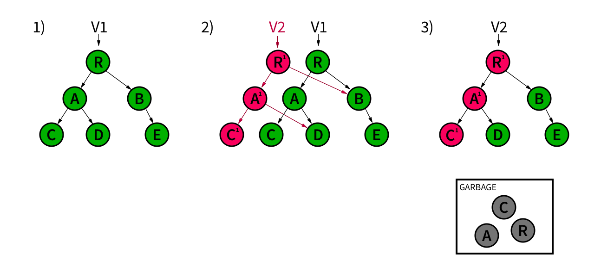

# Threading - Swift SDK
To make your iOS and tvOS apps fast and responsive, you must
balance the computing time needed to lay out the visuals and
handle user interactions with the time needed to process
your data and run your business logic. Typically, app
developers spread this work across multiple threads: the
main or UI thread for all of the user interface-related
work, and one or more background threads to compute heavier
workloads before sending it to the UI thread for
presentation. By offloading heavy work to background
threads, the UI thread can remain highly responsive
regardless of the size of the workload. But it can be
notoriously difficult to write thread-safe, performant, and
maintainable multithreaded code that avoids issues like
deadlocking and race conditions. Realm aims to
simplify this for you.

> Seealso:
> As of 10.26.0, Realm provides async write methods to perform background
writes. See: Perform a Background Write. With
async write, you don't need to pass a thread-safe reference or frozen objects
across threads.
>

This page describes how to manually manage realm files and objects across threads.
Realm also supports using a [Swift actor](https://developer.apple.com/documentation/swift/actor)
to manage realm access using Swift concurrency features. For an overview
of Realm's actor support, refer to Use Realm with Actors - Swift SDK.

## Three Rules to Follow
Before exploring Realm's tools for multithreaded apps, you need to
understand and follow these three rules:

Realm's Multiversion Concurrency Control (MVCC)
architecture eliminates the need to lock for read operations. The values you
read will never be corrupted or in a partially-modified state. You can freely
read from the same Realm file on any thread without the need for locks or
mutexes. Unnecessarily locking would be a performance bottleneck since each
thread might need to wait its turn before reading.

You can write to a Realm file from any thread, but there can be only one
writer at a time. Consequently, synchronous write transactions block each
other. A synchronous write on the UI thread may result in your app appearing
unresponsive while it waits for a write on a background thread to complete.

Live objects, collections, and realm instances are
**thread-confined**: that is, they are only valid on the
thread on which they were created. Practically speaking,
this means you cannot pass live instances to other
threads. However, Realm offers several mechanisms for
sharing objects across threads.

## Perform a Background Write
> Version added: 10.26.0

You can add, modify, or delete objects in the background using
`writeAsync`.

With `writeAsync`, you don't need to pass a thread-safe reference or frozen objects
across threads. Instead, call `realm.writeAsync`. You can provide
a completion block for the method to execute on the source thread after
the write completes or fails.

Things to consider when performing background writes:

- Async writes block closing or invalidating the realm
- You can explicitly commit or cancel transactions

```swift
let realm = try! Realm()

// Query for a specific person object on the main thread
let people = realm.objects(Person.self)
let thisPerson = people.where {
    $0.name == "Dachary"
}.first

// Perform an async write to add dogs to that person's dog list.
// No need to pass a thread-safe reference or frozen object.
realm.writeAsync {
    thisPerson?.dogs.append(objectsIn: [
        Dog(value: ["name": "Ben", "age": 13]),
        Dog(value: ["name": "Lita", "age": 9]),
        Dog(value: ["name": "Maui", "age": 1])
    ])
} onComplete: { _ in
    // Confirm the three dogs were successfully added to the person's dogs list
    XCTAssertEqual(thisPerson!.dogs.count, 3)
    // Query for one of the dogs we added and see that it is present
    let dogs = realm.objects(Dog.self)
    let benDogs = dogs.where {
        $0.name == "Ben"
    }
    XCTAssertEqual(benDogs.count, 1)
}

```

### Wait for Async Writes to Complete
The SDK provides a `Bool` to signal whether the realm is currently
performing an async write. The
`isPerformingAsynchronousWriteOperations`
variable becomes `true` after a call to one of:

- `writeAsync`
- `beginAsyncWrite`
- `commitAsyncWrite`

It remains true until all scheduled async write operations have completed.
While this is true, this blocks closing or `invalidating` the realm.

### Commit or Cancel an Async Write
To complete an async write, you or the SDK must call either:

- `commitAsyncWrite`
- `cancelAsyncWrite`

When you use the `writeAsync` method, the SDK handles committing or
canceling the transaction. This provides the convenience of the async write
without the need to manually keep state tied to the scope of the object.
However, while in the `writeAsync` block, you *can* explicitly call
`commitAsyncWrite` or `cancelAsyncWrite`. If you return without
calling one of these methods, `writeAsync` either:

- Commits the write after executing the instructions in the write block
- Returns an error

In either case, this completes the `writeAsync` operation.

For more control over when to commit or cancel the async write transaction,
use the `beginAsyncWrite` method. When you use this method, you must
explicitly commit the transactions. Returning without committing an async
write cancels the transaction. `beginAsyncWrite` returns an ID that you
can pass to `cancelAsyncWrite`.

`commitAsyncWrite` asynchronously commits a write transaction. This is
the step that persists the data to the realm. `commitAsyncWrite` can
take an `onComplete` block. . This block executes on the source thread
once the commit completes or fails with an error.

Calling `commitAsyncWrite` immediately returns. This allows the caller
to proceed while the SDK performs the I/O on a background thread. This method
returns an ID that you can pass to `cancelAsyncWrite`. This cancels the
pending invocation of the completion block. It does not cancel the commit
itself.

You can group sequential calls to `commitAsyncWrite`. Batching these calls
improves write performance; particularly when the batched transactions are
small. To permit grouping transactions, set the `isGroupingAllowed`
parameter to `true`.

You can call `cancelAsyncWrite` on either `beginAsyncWrite` or
`commitAsyncWrite`. When you call it on `beginAsyncWrite`, this cancels
the entire write transaction. When you call it on `commitAsyncWrite`, this
cancels only an `onComplete` block you may have passed to
`commitAsyncWrite`. It does not cancel the commit itself. You need the ID
of the `beginAsyncWrite` or the `commitAsyncWrite` you want to cancel.

## Communication Across Threads
To access the same Realm file from different threads, you must instantiate a
realm instance on every thread that needs access. As long as you specify the same
configuration, all realm instances will map to the same file on disk.

One of the key rules when working with Realm in a multithreaded
environment is that objects are thread-confined: **you cannot access the
instances of a realm, collection, or object that originated on other threads.**
Realm's Multiversion Concurrency Control (MVCC)
architecture means that there could be many active versions of an object at any
time. Thread-confinement ensures that all instances in that thread are of the
same internal version.

When you need to communicate across threads, you have several options depending
on your use case:

- To modify an object on two threads, query
for the object on both threads.
- To react to changes made on any thread, use Realm's
notifications.
- To see changes that happened on another thread in the current thread's realm
instance, refresh your realm instance.
- To send a fast, read-only view of the object to other threads,
"freeze" the object.
- To keep and share many read-only views of the object in your app, copy
the object from the realm.
- To share an instance of a realm or specific object with another thread or
across actor boundaries, share a thread-safe reference to the realm instance or object. For more
information, refer to Pass a ThreadSafeReference.

### Create a Serial Queue to use Realm on a Background Thread
When using Realm on a background thread, create a serial queue. Realm
does not support using realms in concurrent queues, such as the `global()`
queue.

```swift
// Initialize a serial queue, and
// perform realm operations on it
let serialQueue = DispatchQueue(label: "serial-queue")
serialQueue.async {
    let realm = try! Realm(configuration: .defaultConfiguration, queue: serialQueue)
    // Do something with Realm on the non-main thread
}

```

### Pass Instances Across Threads
Instances of `Realm`, `Results`, `List`, and managed `Objects`
are *thread-confined*. That means you may only use them on the thread
where you created them. However, Realm provides a mechanism called
**thread-safe references** that allows you to copy an instance
created on one thread to another thread.

#### Sendable Conformance
> Version added: 10.20.0
> @ThreadSafe wrapper and ThreadSafeReference conform to `Sendable`
>

If you are using Swift 5.6 or higher, both the `@ThreadSafe
property wrapper` and
`ThreadSafeReference`
conform to [Sendable](https://developer.apple.com/documentation/swift/sendable).

#### Use the @ThreadSafe Wrapper
> Version added: 10.17.0

You can pass thread-confined instances to another thread as follows:

1. Use the `@ThreadSafe` property wrapper to declare a variable that references the original object. By definition, `@ThreadSafe`-wrapped variables are always optional.
2. Pass the `@ThreadSafe`-wrapped variable to the other thread.
3. Use the `@ThreadSafe`-wrapped variable as you would any optional. If the referenced object is removed from the realm, the referencing variable becomes nil.

```swift
let realm = try! Realm()

let person = Person(name: "Jane")
try! realm.write {
    realm.add(person)
}

// Create thread-safe reference to person
@ThreadSafe var personRef = person

// @ThreadSafe vars are always optional. If the referenced object is deleted,
// the @ThreadSafe var will be nullified.
print("Person's name: \(personRef?.name ?? "unknown")")

// Pass the reference to a background thread
DispatchQueue(label: "background", autoreleaseFrequency: .workItem).async {
    let realm = try! Realm()
    try! realm.write {
        // Resolve within the transaction to ensure you get the
        // latest changes from other threads. If the person
        // object was deleted, personRef will be nil.
        guard let person = personRef else {
            return // person was deleted
        }
        person.name = "Jane Doe"
    }
}

```

Another way to work with an object on another thread is to query for it
again on that thread. But if the object does not have a primary
key, it is not trivial to
query for it. You can use the `@ThreadSafe` wrapper on any object,
regardless of whether it has a primary key.

> Example:
> The following example shows how to use `@ThreadSafe` on a function
parameter. This is useful for functions that may run asynchronously
or on another thread.
>
> > Tip:
> > If your app accesses Realm in an `async/await` context, mark the code
with `@MainActor` to avoid threading-related crashes.
> >
>
> ```swift
> func someLongCallToGetNewName() async -> String {
>     return "Janet"
> }
>
> @MainActor
> func loadNameInBackground(@ThreadSafe person: Person?) async {
>     let newName = await someLongCallToGetNewName()
>     let realm = try! await Realm()
>     try! realm.write {
>         person?.name = newName
>     }
> }
>
> @MainActor
> func createAndUpdatePerson() async {
>     let realm = try! await Realm()
>
>     let person = Person(name: "Jane")
>     try! realm.write {
>         realm.add(person)
>     }
>     await loadNameInBackground(person: person)
> }
>
> await createAndUpdatePerson()
>
> ```
>

#### Use ThreadSafeReference (Legacy Swift / Objective-C)
Before Realm Swift SDK version 10.17.0 or in Objective-C, you can pass
thread-confined instances to another thread as follows:

1. Initialize a `ThreadSafeReference` with the thread-confined object.
2. Pass the reference to the other thread or queue.
3. Resolve the reference on the other thread's realm by calling `Realm.resolve(_:)`. Use the returned object as normal.

> Important:
> You must resolve a `ThreadSafeReference` exactly once. Otherwise,
the source realm remains pinned until the reference gets
deallocated. For this reason, `ThreadSafeReference` should be
short-lived.
>

```swift
let person = Person(name: "Jane")
let realm = try! Realm()

try! realm.write {
    realm.add(person)
}

// Create thread-safe reference to person
let personRef = ThreadSafeReference(to: person)

// Pass the reference to a background thread
DispatchQueue(label: "background", autoreleaseFrequency: .workItem).async {
    let realm = try! Realm()
    try! realm.write {
        // Resolve within the transaction to ensure you get the latest changes from other threads
        guard let person = realm.resolve(personRef) else {
            return // person was deleted
        }
        person.name = "Jane Doe"
    }
}

```

Another way to work with an object on another thread is to query for it
again on that thread. But if the object does not have a primary
key, it is not trivial to
query for it. You can use `ThreadSafeReference` on any object,
regardless of whether it has a primary key. You can also use it with
lists and results.

The downside is that `ThreadSafeReference` requires some boilerplate.
You must remember to wrap everything in a `DispatchQueue` with a
properly-scoped `autoreleaseFrequency` so the objects do not linger on
the background thread. So, it can be helpful to make a convenience extension
to handle the boilerplate as follows:

```swift
extension Realm {
    func writeAsync<T: ThreadConfined>(_ passedObject: T, errorHandler: @escaping ((_ error: Swift.Error) -> Void) = { _ in return }, block: @escaping ((Realm, T?) -> Void)) {
        let objectReference = ThreadSafeReference(to: passedObject)
        let configuration = self.configuration
        DispatchQueue(label: "background", autoreleaseFrequency: .workItem).async {
            do {
                let realm = try Realm(configuration: configuration)
                try realm.write {
                    // Resolve within the transaction to ensure you get the latest changes from other threads
                    let object = realm.resolve(objectReference)
                    block(realm, object)
                }
            } catch {
                errorHandler(error)
            }
        }
    }
}

```

This extension adds a `writeAsync()` method to the Realm class. This
method passes an instance to a background thread for you.

> Example:
> Suppose you made an email app and want to delete all read emails in
the background. You can now do it with two lines of code. Note that
the closure runs on the background thread and receives its own
version of both the realm and passed object:
>
> ```swift
> let realm = try! Realm()
> let readEmails = realm.objects(Email.self).where {
>     $0.read == true
> }
> realm.writeAsync(readEmails) { (realm, readEmails) in
>     guard let readEmails = readEmails else {
>         // Already deleted
>         return
>     }
>     realm.delete(readEmails)
> }
>
> ```
>

### Use the Same Realm Across Threads
You cannot share realm instances across threads.

To use the same Realm file across threads, open a different realm
instance on each thread. As long as you use the same
`configuration`, all Realm
instances will map to the same file on disk.

### Refreshing Realms
When you open a realm, it reflects the most recent successful write
commit and remains on that version until it is **refreshed**. This means
that the realm will not see changes that happened on another thread
until the next refresh. A realm on the UI thread -- more precisely,
on any event loop thread -- automatically refreshes itself at
the beginning of that thread's loop. However, you must manually refresh
realm instances that do not exist on loop threads or that have
auto-refresh disabled.

#### Objective-C

```objective-c
if (![realm autorefresh]) {
    [realm refresh]
}
```

#### Swift

```swift
if (!realm.autorefresh) {
   // Manually refresh
   realm.refresh()
}
```

### Frozen Objects
Live, thread-confined objects work fine in most cases.
However, some apps -- those based on reactive, event
stream-based architectures, for example -- need to send
immutable copies around to many threads for processing
before ultimately ending up on the UI thread. Making a deep
copy every time would be expensive, and Realm does not allow
live instances to be shared across threads. In this case,
you can **freeze** and **thaw** objects, collections, and realms.

Freezing creates an immutable view of a specific object,
collection, or realm. The frozen object, collection, or realm still
exists on disk, and does not need to be deeply copied when passed around
to other threads. You can freely share the frozen object across threads
without concern for thread issues. When you freeze a realm, its child
objects also become frozen.

> Tip:
> Realm does not currently support using `thaw()` with Swift Actors.
To work with Realm data across actor boundaries, use
`ThreadSafeReference` instead of frozen objects. For more information,
refer to Pass a ThreadSafeReference.
>

Frozen objects are not live and do not automatically update.
They are effectively snapshots of the object state at the
time of freezing. Thawing an object returns a live version of the frozen
object.

#### Objective-C

```objectivec
// Get an immutable copy of the realm that can be passed across threads
RLMRealm *frozenRealm = [realm freeze];

RLMResults *dogs = [Dog allObjectsInRealm:realm];

// You can freeze collections
RLMResults *frozenDogs = [dogs freeze];

// You can still read from frozen realms
RLMResults *frozenDogs2 = [Dog allObjectsInRealm:frozenRealm];

Dog *dog = [dogs firstObject];

// You can freeze objects
Dog *frozenDog = [dog freeze];

// To modify frozen objects, you can thaw them
// You can thaw collections
RLMResults *thawedDogs = [dogs thaw];

// You can thaw objects
Dog *thawedDog = [dog thaw];

// You can thaw frozen realms
RLMRealm *thawedRealm = [realm thaw];
```

#### Swift

```swift
let realm = try! Realm()

// Get an immutable copy of the realm that can be passed across threads
let frozenRealm = realm.freeze()

assert(frozenRealm.isFrozen)

let people = realm.objects(Person.self)

// You can freeze collections
let frozenPeople = people.freeze()

assert(frozenPeople.isFrozen)

// You can still read from frozen realms
let frozenPeople2 = frozenRealm.objects(Person.self)

assert(frozenPeople2.isFrozen)

let person = people.first!

assert(!person.realm!.isFrozen)

// You can freeze objects
let frozenPerson = person.freeze()

assert(frozenPerson.isFrozen)
// Frozen objects have a reference to a frozen realm
assert(frozenPerson.realm!.isFrozen)

```

When working with frozen objects, an attempt to do any of
the following throws an exception:

- Opening a write transaction on a frozen realm.
- Modifying a frozen object.
- Adding a change listener to a frozen realm, collection, or object.

You can use `isFrozen` to check if the object is frozen. This is always
thread-safe.

#### Objective-C

```objective-c
if ([realm isFrozen]) {
    // ...
}
```

#### Swift

```swift
if (realm.isFrozen) {
    // ...
}
```

Frozen objects remain valid as long as the live realm that
spawned them stays open. Therefore, avoid closing the live
realm until all threads are done with the frozen objects.
You can close a frozen realm before the live realm is closed.

> Important:
> Caching too many frozen objects can have a negative
impact on the realm file size. "Too many" depends on your
specific target device and the size of your Realm
objects. If you need to cache a large number of versions,
consider copying what you need out of the realm instead.
>

#### Modify a Frozen Object
To modify a frozen object, you must thaw the object. Alternately, you can
query for it on an unfrozen realm, then modify it. Calling `thaw`
on a live object, collection, or realm returns itself.

Thawing an object or collection also thaws the realm it references.

```swift
// Read from a frozen realm
let frozenPeople = frozenRealm.objects(Person.self)

// The collection that we pull from the frozen realm is also frozen
assert(frozenPeople.isFrozen)

// Get an individual person from the collection
let frozenPerson = frozenPeople.first!

// To modify the person, you must first thaw it
// You can also thaw collections and realms
let thawedPerson = frozenPerson.thaw()

// Check to make sure this person is valid. An object is
// invalidated when it is deleted from its managing realm,
// or when its managing realm has invalidate() called on it.
assert(thawedPerson?.isInvalidated == false)

// Thawing the person also thaws the frozen realm it references
assert(thawedPerson!.realm!.isFrozen == false)

// Let's make the code easier to follow by naming the thawed realm
let thawedRealm = thawedPerson!.realm!

// Now, you can modify the todo
try! thawedRealm.write {
   thawedPerson!.name = "John Michael Kane"
}

```

#### Append to a Frozen Collection
When you append to a frozen collection,
you must thaw both the collection and the object that you want to append.
In this example, we query for two objects in a frozen Realm:

- A Person object that has a List property
of Dog objects
- A Dog object

We must thaw both objects before we can append the Dog to
the Dog List collection on the Person. If we thaw only the Person object
but not the Dog, Realm throws an error.

The same rule applies when passing frozen objects across threads. A common
case might be calling a function on a background thread to do some work
instead of blocking the UI.

```swift
// Get a copy of frozen objects.
// Here, we're getting them from a frozen realm,
// but you might also be passing them across threads.
let frozenTimmy = frozenRealm.objects(Person.self).where {
    $0.name == "Timmy"
}.first!
let frozenLassie = frozenRealm.objects(Dog.self).where {
    $0.name == "Lassie"
}.first!
// Confirm the objects are frozen.
assert(frozenTimmy.isFrozen == true)
assert(frozenLassie.isFrozen == true)
// Thaw the frozen objects. You must thaw both the object
// you want to append and the collection you want to append it to.
let thawedTimmy = frozenTimmy.thaw()
let thawedLassie = frozenLassie.thaw()
let realm = try! Realm()
try! realm.write {
    thawedTimmy?.dogs.append(thawedLassie!)
}
XCTAssertEqual(thawedTimmy?.dogs.first?.name, "Lassie")

```

## Realm's Threading Model in Depth
Realm provides safe, fast, lock-free, and concurrent access
across threads with its [Multiversion Concurrency
Control (MVCC)](https://en.wikipedia.org/wiki/Multiversion_concurrency_control)
architecture.

### Compared and Contrasted with Git
If you are familiar with a distributed version control
system like [Git](https://git-scm.com/), you may already
have an intuitive understanding of MVCC. Two fundamental
elements of Git are:

- Commits, which are atomic writes.
- Branches, which are different versions of the commit history.

Similarly, Realm has atomically-committed writes in the form
of transactions. Realm also has many
different versions of the history at any given time, like
branches.

Unlike Git, which actively supports distribution and
divergence through forking, a realm only has one true latest
version at any given time and always writes to the head of
that latest version. Realm cannot write to a previous
version. This means your data converges on one
latest version of the truth.

### Internal Structure
A realm is implemented using a [B+ tree](https://en.wikipedia.org/wiki/B%2B_tree) data structure. The top-level node represents a
version of the realm; child nodes are objects in that
version of the realm. The realm has a pointer to its latest
version, much like how Git has a pointer to its HEAD commit.

Realm uses a copy-on-write technique to ensure
[isolation](https://en.wikipedia.org/wiki/Isolation_(database_systems)) and
[durability](https://en.wikipedia.org/wiki/Durability_(database_systems)).
When you make changes, Realm copies the relevant part of the
tree for writing. Realm then commits the changes in two
phases:

- Realm writes changes to disk and verifies success.
- Realm then sets its latest version pointer to point to the newly-written version.

This two-step commit process guarantees that even if the
write failed partway, the original version is not corrupted
in any way because the changes were made to a copy of the
relevant part of the tree. Likewise, the realm's root
pointer will point to the original version until the new
version is guaranteed to be valid.

> Example:
> The following diagram illustrates the commit process:
>
> 
>
> 1. The realm is structured as a tree. The realm has a pointer
to its latest version, V1.
> 2. When writing, Realm creates a new version V2 based on V1.
Realm makes copies of objects for modification (A 1,
C 1),  while links to unmodified objects continue to
point to the original versions (B, D).
> 3. After validating the commit, Realm updates the
pointer to the new latest version, V2. Realm then discards
old nodes no longer connected to the tree.
>

Realm uses zero-copy techniques
like memory mapping to handle data. When you read a value
from the realm, you are virtually looking at the value on
the actual disk, not a copy of it. This is the basis for
live objects. This is also why a realm
head pointer can be set to point to the new version after
the write to disk has been validated.

## Summary
- Realm enables simple and safe multithreaded code when you follow
these rules: don't lock to readavoid writes on the UI thread if you
write on background threads, and don't pass live objects to other threads.
- There is a proper way to share objects across threads for each use case.
- In order to see changes made on other threads in your realm
instance, you must manually **refresh** realm instances that do
not exist on "loop" threads or that have auto-refresh disabled.
- For apps based on reactive, event-stream-based architectures, you can
**freeze** objects, collections, and realms in order to pass
shallow copies around efficiently to different threads for processing.
- Realm's multiversion concurrency control (MVCC)
architecture is similar to Git's. Unlike Git, Realm has
only one true latest version for each realm.
- Realm commits in two stages to guarantee isolation and durability.

## Sendable, Non-Sendable and Thread-Confined Types
The Realm Swift SDK public API contains types that fall into three broad
categories:

- Sendable
- Not Sendable and not thread confined
- Thread-confined

You can share types that are not Sendable and not thread confined between
threads, but you must synchronize them.

Thread-confined types, unless frozen, are confined to an isolation context.
You cannot pass them between these contexts even with synchronization.
