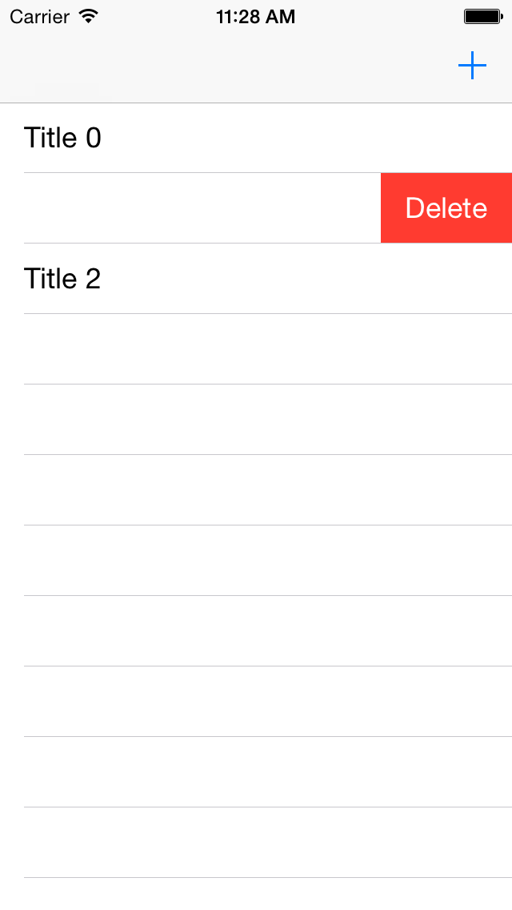

# Realm Demo Project

This sample project demonstrates the main concepts behind Realm, from creating data model objects to creating/removing/reading data.

## Building & Running

The project requires the Realm framework (v0.10.0) to be linked before being able to run. There is no step 2.

