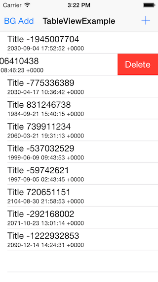

# Realm Table View Example

This very simple project demonstrates how to create a `UITableViewController` backed by Realm.



You can add rows by tapping the add button and remove rows by swiping right-to-left.

The application also demonstrates how to import large amounts of data in a background thread.

You'll have to build the `Realm.framework` to be able to run this project. Run these commands from the root of this repository:

```objc
$ sh build.sh config
$ sh build.sh build
$ sh build.sh build-iphone
$ sh build.sh ios-framework
```

See [realm.io](http://realm.io/docs/ios) for documentation and more information about Realm.
